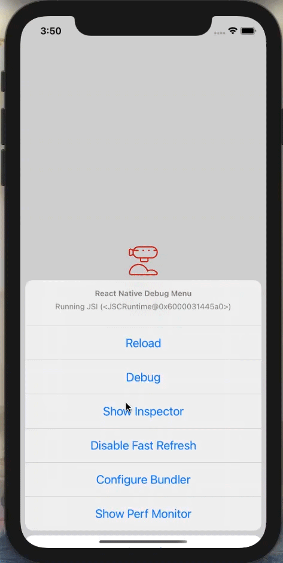

# @airship/rn-components

This is a component library created and used by Airship for quickly building out **consistent** and **high quality** React Native apps! It will be made up of basic inputs and animated wrapper components. This library will be included in all [Airfoil](https://github.com/teamairship/airfoil) templates by default.

## Features
- ✨ Easy to use, configurable components
- 📱 Animations that use the UI thread for a consistent 60fps on iOS and Android
- ⏳ Saves you from building basic components from scratch every project


## Getting Started

To add to your project, run the command
```
yarn add @airship/rn-components
```

<br />

## Example App
🛠 <i>Coming Soon</i>

<br />

## API Reference

### AnimatedFade
An animated <b>View</b> that can wrap a React Native component fade a component in or fade it out.

Example:
```
<AnimatedFade delay={1000}>
  {children}
</AnimatedFade>
```


| Prop | Type | Required | Default | Description |
| --- | :--: | :--: | :--: | --- |
| <b>fadeOnMount</b> | <i>boolean</i> | no | `true` | AnimatedFade is set to fade in its opacity from `0` to `1` on render. |
| <b>triggerFade</b> | <i>boolean</i> | no | `false` | Setting to `true` will cause the fade animation to start. |
| <b>startingOpacity</b> | <i>number</i> | no | `0` | Defaults to `0`. Values can range from `0.0 - 1.0` |
| <b>endingOpacity</b> | <i>number</i> | no | `1` | Defaults to `1`. Values can range from `0.0 - 1.0` |
| <b>duration</b> | <i>number</i> | no | `800` | Specify in `ms` how long the fade animation lasts. |
| <b>delay</b> | <i>number</i> | no | `0` | Specify in `ms` how long to wait until the fade animation occurs. |
| <b>style</b> | <i>ViewStyle</i> | no | `undefined` | Pass React Native `View` styles to AnimatedFade. |
| <b>onEnd</b> | <i>() => void</i> | no | `undefined` | When the animation finishes and this function exists, the `onEnd` function will be called. |
<br />

### AnimatedMove
An animated <b>View</b> that can wrap a React Native component and move its position.

Example:
```
<AnimatedMove startY={-50} delay={1000}>
  {children}
</AnimatedMove>
```


| Prop | Type | Required | Default | Description |
| --- | :--: | :--: | :--: | --- |
| <b>moveOnMount</b> | <i>boolean</i> | no | `true` | AnimatedMove is set to start animating on render. Setting this to `false` in conjunction with `triggerMove` will allow you to control when the animation occurs. |
| <b>triggerMove</b> | <i>boolean</i> | no | `false` | Setting to `true` will cause the move animation to start. |
| <b>tension</b> | <i>number</i> | no | `18` | Controls the speed. [Reference](https://reactnative.dev/docs/animated#spring) |
| <b>friction</b> | <i>number</i> | no | `4` | Controls "bounciness"/overshoot. [Reference](https://reactnative.dev/docs/animated#spring) |
| <b>toX</b> | <i>number</i> | no | `0` | Move your component to a new `X` position. |
| <b>toY</b> | <i>number</i> | no | `0` | Move your component to a new `Y` position. |
| <b>startX</b> | <i>number</i> | no | `0` | Move your component to its `X` origin position (ex. setting to `-10` will have the component move from the `left` to its position you have in your styles). |
| <b>startY</b> | <i>number</i> | no | `0` | Move your component to its `Y` origin position (ex. setting to `-10` will have the component move from the `top` to its position you have in your styles). |
| <b>delay</b> | <i>number</i> | no | `0` | Specify in `ms` how long to wait until the animation occurs. |
| <b>style</b> | <i>ViewStyle</i> | no | `undefined` | Pass React Native `View` styles to AnimatedMove. |
| <b>onEnd</b> | <i>() => void</i> | no | `undefined` | When the animation finishes and this function exists, the `onEnd` function will be called. |