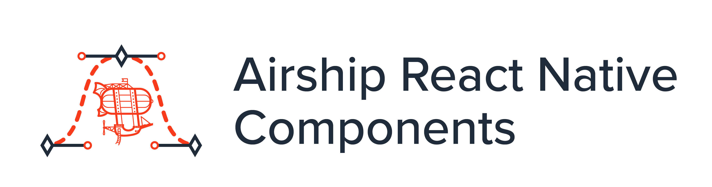
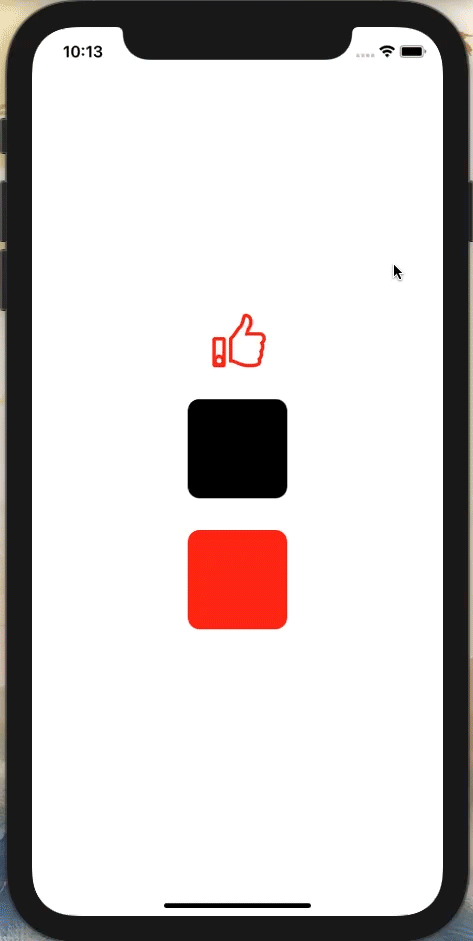
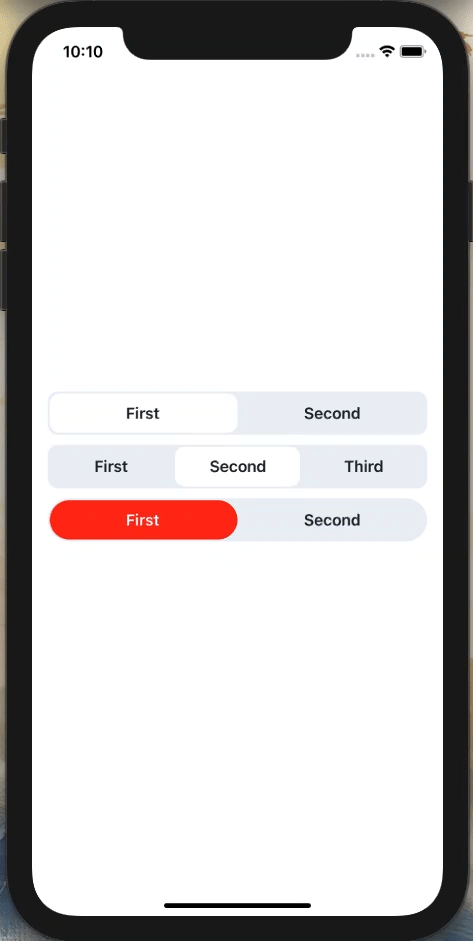

# @airship/rn-components



<br /> This is a component library created and used by Airship for quickly building out **consistent** and **high quality** React Native apps! It is made up of basic inputs and animated wrapper components. This library is included in all [Airfoil](https://github.com/teamairship/airfoil) templates by default.

## Features

- ✨ Easy to use, configurable components
- 📱 Animations that use the UI thread for a consistent 60fps on iOS and Android
- ⏳ Saves you from building basic components from scratch every project

## Getting Started

To add to your project, run the command

```
yarn add @airship/rn-components
```

<br />

## Directory 📚

- [@airship/rn-components](#airshiprn-components)
  - [Features](#features)
  - [Getting Started](#getting-started)
  - [Directory 📚](#directory-)
  - [API Reference](#api-reference)
    - [<b>AnimatedFade</b>](#banimatedfadeb)
    - [<b>AnimatedMove</b>](#banimatedmoveb)
    - [<b>AnimatedPressable</b>](#banimatedpressableb)
    - [<b>SegmentedControl</b>](#bsegmentedcontrolb)

<br />

## API Reference

### <b>AnimatedFade</b>

An animated <b>View</b> that can wrap a React Native component fade a component in or fade it out.

Example:

```
import { AnimatedFade } from '@airship/rn-components';

<AnimatedFade delay={1000}>
  {children}
</AnimatedFade>
```


| Prop | Type | Required | Default | Description |
| --- | :--: | :--: | :--: | --- |
| <b>triggerFade</b> | <i>boolean</i> | no | `true` | By default, animation is triggered on mount. `triggerFade` allows for controlled triggering. |
| <b>loop</b> | <i>boolean</i> | no | `false` | Enables looping for the animation |
| <b>opacityStart</b> | <i>number</i> | no | `0` | Defaults to `0`. Values can range from `0.0 - 1.0` |
| <b>opacityEnd</b> | <i>number</i> | no | `1` | Defaults to `1`. Values can range from `0.0 - 1.0` |
| <b>duration</b> | <i>number</i> | no | `800` | Specify in `ms` how long the fade animation lasts. |
| <b>delay</b> | <i>number</i> | no | `0` | Specify in `ms` how long to wait until the fade animation occurs. |
| <b>style</b> | <i>ViewStyle</i> | no | `undefined` | Pass React Native `View` styles to `AnimatedFade`. |
| <b>onEnd</b> | <i>() => void</i> | no | `undefined` | When the animation finishes and this function exists, the `onEnd` function will be called. |

<br />
<br />

### <b>AnimatedMove</b>

An animated <b>View</b> that can wrap a React Native component and move its position.

Example:

```
import { AnimatedMove } from '@airship/rn-components';

<AnimatedMove startY={-50} delay={1000}>
  {children}
</AnimatedMove>
```


| Prop | Type | Required | Default | Description |
| --- | :--: | :--: | :--: | --- |
| <b>moveOnMount</b> | <i>boolean</i> | no | `true` | AnimatedMove is set to start animating on render. Setting this to `false` in conjunction with `triggerMove` will allow you to control when the animation occurs. |
| <b>triggerMove</b> | <i>boolean</i> | no | `false` | Setting to `true` will cause the move animation to start. |
| <b>tension</b> | <i>number</i> | no | `18` | Controls the speed. [Reference](https://reactnative.dev/docs/animated#spring) |
| <b>friction</b> | <i>number</i> | no | `4` | Controls "bounciness"/overshoot. [Reference](https://reactnative.dev/docs/animated#spring) |
| <b>toX</b> | <i>number</i> | no | `0` | Move your component to a new `X` position. |
| <b>toY</b> | <i>number</i> | no | `0` | Move your component to a new `Y` position. |
| <b>startX</b> | <i>number</i> | no | `0` | Move your component to its `X` origin position (ex. setting to `-10` will have the component move from the `left` to its position you have in your styles). |
| <b>startY</b> | <i>number</i> | no | `0` | Move your component to its `Y` origin position (ex. setting to `-10` will have the component move from the `top` to its position you have in your styles). |
| <b>delay</b> | <i>number</i> | no | `0` | Specify in `ms` how long to wait until the animation occurs. |
| <b>style</b> | <i>ViewStyle</i> | no | `undefined` | Pass React Native `View` styles to `AnimatedMove`. |
| <b>onEnd</b> | <i>() => void</i> | no | `undefined` | When the animation finishes and this function exists, the `onEnd` function will be called. |

<br />
<br />

### <b>AnimatedPressable</b>

An animated <b>View</b> that changes its scale on press, and returns to its original position on the press out. It can render out a component with props available to it such as color interpolation based on the pressed state.

Example:

```
import { AnimatedPressable } from '@airship/rn-components';

<View>
  <AnimatedPressable
    colorStart={'rgb(255, 255, 255)'}
    colorEnd={'rgb(255, 42, 19)'}
    renderComponent={(colorInterpolation) => (
      <ThumbsUpSVG
        height={54}
        width={63}
        stroke={colors.orange}
        fillColor={colorInterpolation}
      />
    )}
  />
  <AnimatedPressable
    toScaleValue={0.8}
    friction={12}
    tension={120}
    onPress={() => Alert.alert('Pressed!')}
    renderComponent={() => (
      <View
        style={{
          marginTop: 32,
          width: 100,
          height: 100,
          backgroundColor: colors.trueBlack,
          borderRadius: 12,
        }}
      />
    )}
  />
  <AnimatedPressable
    toScaleValue={1.5}
    renderComponent={() => (
      <View
        style={{
          marginTop: 32,
          width: 100,
          height: 100,
          backgroundColor: colors.orange,
          borderRadius: 12,
        }}
      />
    )}
  />
</View>
```



| Prop | Type | Required | Default | Description |
| --- | :--: | :--: | :--: | --- |
| <b>toScaleValue</b> | <i>number</i> | no | `0.5` | This number controls how much the `Animated.View` will scale. It can be lower or higher than 1. |
| <b>tension</b> | <i>number</i> | no | `18` | Controls the speed. [Reference](https://reactnative.dev/docs/animated#spring) |
| <b>friction</b> | <i>number</i> | no | `4` | Controls "bounciness"/overshoot. [Reference](https://reactnative.dev/docs/animated#spring) |
| <b>colorStart</b> | <i>string</i> | no | `null` | Initial color value, <b>must</b> be given as a rgb string. Color interpolation does not work with hexes. NOTE: Works off of `pressed`. Think of it as a "like" button. If `pressed` has a `true` value, that means the current color is `colorEnd`. |
| <b>colorEnd</b> | <i>string</i> | no | `null` | End color value, <b>must</b> be given as a rgb string. Color interpolation does not work with hexes. NOTE: Works off of `pressed`. Think of it as a "like" button. If `pressed` has a `true` value, that means the current color is `colorEnd`. |
| <b>isPressed</b> | <i>boolean</i> | no | `false` | The current state of `AnimatedPressable`. Can be passed a value such as starting with `pressed` set to `true`, which means the `colorEnd` is the starting color. |
| <b>onPress</b> | <i>() => void</i> | no | `undefined` | When the animation finishes (press out) and this function exists, the `onPress` function will be called. |
| <b>callFunctionOnPressIn</b> | <i>boolean</i> | no | `false` | Setting to true will cause the `onPress` function to call on the press in of the tap instead of the press out default. |
| <b>renderComponent</b> | <i>(colorInterpolation: Animated.AnimatedInterpolation) => React.ReactElement</i> | no | `undefined` | This render function allows for a child component to be passed with access to the `colorInterpolation` values <b>IF</b> a `colorStart` and `colorEnd` have been set. Otherwise the value will not exist and will render the component without value to `colorInterpolation`. |
| <b>style</b> | <i>ViewStyle</i> | no | `undefined` | Pass React Native `View` styles to `AnimatedPressable`. |

<br />
<br />

### <b>SegmentedControl</b>

An animated tab controller for selections in an app with customizable color schemes.

Example:

```
import React, { useState } from 'react';
import { StyleSheet } from 'react-native';
import { SegmentedControl } from '@airship/rn-components';

export const App = () => {
  const [currIdx, setCurrIdx] = useState(0);
  const [currIdx2, setCurrIdx2] = useState(0);
  const [currIdx3, setCurrIdx3] = useState(0);

  return (
    <View>
      <SegmentedControl
        tabs={['First', 'Second']}
        onChange={(idx) => setCurrIdx(idx)}
        currentIndex={currIdx}
        activeSegmentBackgroundColor={colors.background}
        containerStyle={styles.segmentContainer}
        textStyle={styles.textStyle}
      />
      <SegmentedControl
        tabs={['First', 'Second', 'Third']}
        onChange={(idx) => setCurrIdx2(idx)}
        currentIndex={currIdx2}
        activeSegmentBackgroundColor={colors.background}
        containerStyle={styles.segmentContainer}
        textStyle={styles.textStyle}
      />
      <SegmentedControl
        tabs={['First', 'Second']}
        onChange={(idx) => setCurrIdx3(idx)}
        currentIndex={currIdx3}
        activeSegmentBackgroundColor={colors.orange}
        containerStyle={styles.segmentContainerCustom}
        textStyle={styles.textStyle}
        activeTextColor={'#FFF'}
        activeContainerStyles={styles.activeContainer}
      />
    </View>
  )

  const styles = StyleSheet.create({
    segmentContainer: {
      backgroundColor: colors.background3,
    },
    segmentContainerCustom: {
      backgroundColor: colors.background3,
      borderRadius: 50,
    },
    textStyle: {
      color: colors.text,
    },
    activeContainer: { borderRadius: 50 },
  })
}
```



| Prop | Type | Required | Default | Description |
| --- | :--: | :--: | :--: | --- |
| <b>tabs</b> | <i>string[]</i> | yes | `[]` | An array of strings, with each one being a label for each tab. |
| <b>onChange</b> | <i>(index: number) => void</i> | yes | `null` | Exposes the current index when changing tabs for state management. |
| <b>currentIndex</b> | <i>number</i> | yes | `null` | This is the currently selected tab. |
| <b>activeSegmentBackgroundColor</b> | <i>string</i> | yes | `''` | Color for the currently selected tab. |
| <b>containerStyle</b> | <i>ViewStyle</i> | no | `null` | Add additional/override styling to the segment container. |
| <b>textStyle</b> | <i>TextStyle</i> | no | `null` | Add additional/override styling to the text components. |
| <b>activeTextColor</b> | <i>string</i> | no | `#20242B` | Color of the text in the active selected tab. |
| <b>activeContainerStyles</b> | <i>ViewStyle</i> | no | `null` | Add additional/override styling to the active selected tab container. |

<br />
<br />
